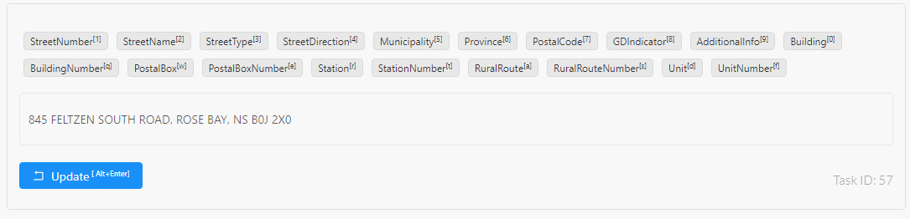

# ez-address-parser

An address parser for Canadian postal addressess

## Install

From [PyPi](https://pypi.org/project/ez-address-parser/)

    pip install ez-address-parser

From [GitHub](https://github.com/zehengl/ez-address-parser)

    pip install git+https://github.com/zehengl/ez-address-parser.git

## Usage

### Command Line

    python -m ez_address_parser --address <some-address>

### Code (with pretrained model)

    from ez_address_parser import AddressParser

    ap = AddressParser()

    address = input("Address: ")
    result = ap.parse(address)
    for token, label in result:
        print(f"{token:20s} -> {label}")

### Code (without pretrained model)

    from ez_address_parser import AddressParser

    ap = AddressParser(use_pretrained=False)

    data = [
        [
            ('123', 'StreetNumber'),
            ('Main', 'StreetName'),
            ('St', 'StreetType'),
            ('E', 'StreetDirection')
        ],
        ...
    ] # list of list of (<token>, <label>) tuple

    ap.train(data)

    address = input("Address: ")
    result = ap.parse(address)
    for token, label in result:
        print(f"{token:20s} -> {label}")

## Test

    python setup.py test

## Develop

    pip install -r requirements-dev.txt

### Annotation

    python .\ez_address_annotator\data\convert.py
    python .\ez_address_annotator\data\create_seed.py
    label-studio start ez_address_annotator

`label-studio` provides an ease of use interface for name entity recognition. See the below example.

### Pretrained Model

    python .\ez_address_annotator\data\export.py
    python .\create_pretrained_model.py

130 annotated adddresses are used to train a default model that comes with this package.
